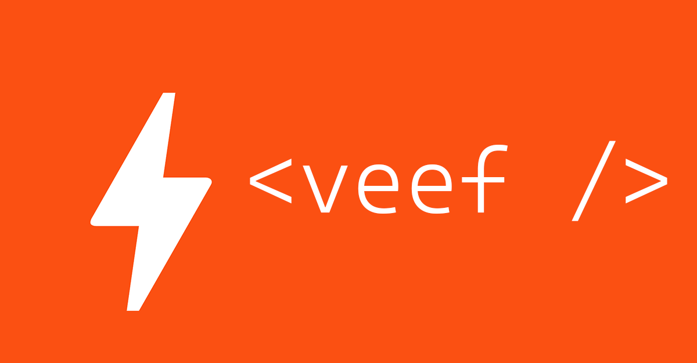

Setup
-----

```html
<script type="module">
import "https://unpkg.com/veef"; // should be under 60KB
// you have now loaded every <v-component> and its styles.
</script>
```


**v-tree**: instant JSON object preview
---------------------------------------

```html
<v-tree id="tree"></v-tree>

<script>
fetch("https://run.mocky.io/v3/7b1ccde5-01bf-4e12-9a23-d87ff910a0cd")
.then(x => x.json()).then(resp => {
    tree.data = resp;
});
</script>
```

### You can pass JSON directly too:

The data property can also be set using HTML attributes, like this:

```html
<v-tree id="tree" data='{"some":"json"}'></v-tree>
```

**v-search**: instant fuzzy search
----------------------------------

Search Queen songs: (look at the page HTML to see the dataset)

```html
<v-search autofuzz="label">
<data value="id-1">
  Some label that can be matched against
</data>
<data value="id-2">
  List all your documents here
</data>
</v-search>
```

### JSX-like search result customization and a custom matcher

Custom elements can use slot="" names which attach tells the component where to place it or what it does.

The v-search tag has a slot="setup" that can be used for a setup script which must be a function taking a single argument. **We suggest you name it h** because it is the 'h' from [Jason Miller's htm project](https://github.com/developit/htm) and is used for HTM expressions:

```html
<v-search id="s">
 <script slot="setup">
    (h) => {
        const suggestList = new Array(5).fill(0);
        this.rowRender = (row) => h`${row.label}`
        this.addEventListener('input', (x) => {
            if(x.target.value.trim().length == 0) return;
            let q = x.target.value.trim();
            this.suggestions = suggestList.map((_, value) => (
                {value, label: h`<small>Item ${value};</small> you typed <b>${q}</i>`}
            ))
            this.objToString = (x) => `Item ${x.value}: ${this.value}`;
        })
    }
 </script>
</v-search>
```

veef will make sure that:

-   the anonymous function will be called when the component is ready
-   'this' inside refers to the particular element.
-   the namespace isn't polluted by anything by using Function objects instead of eval

**v-table**: just put <table> inside
------------------------------------

You get some styling, sorting and checkboxes for free!

**v-dialog**: a full screen dialog
----------------------------------

```html
<v-dialog id="dlg1">
  Some HTML
</v-dialog>
<script>
  dlg1.open = true;
</script>
```

### The style of icons/buttons in the example

The actual example has styled buttons, but that depends on your own CSS.

**Web Components aren't supposed to touch your site's styles**, but we provide some nice defaults with data-intent:

```html
<v-dialog>
  <v-icon name="Delete" data-intent="message"></v-icon>

  <div>
    <h1>Some title</h1>
    <h3>Arbitrary HTML</h3>
  </div>

  <section data-intent="actions">
      <button data-intent="primary" onclick="d1.open = false">Okay</button>
      <button data-intent="secondary" onclick="d1.open = false">Meh</button>
  </section>
</v-dialog>
```

**v-alert**: styled message boxes
---------------------------------

```html
<v-alert success>Put any HTML here.</v-alert>
<v-alert warning>Put any HTML here.</v-alert>
<v-alert error>Put any HTML here.</v-alert>
<v-alert info>Put any HTML here.</v-alert>
```

**v-icon**: a few useful svg icons
----------------------------------

The syntax is just `<v-icon name="IconName">`.

-   The color comes from the text color of the parent.
-   The size comes from the CSS width/height of the element.

And if you forget the names, you can just use <v-icon all> and it will show all the icons and their names.

License
-------

veef is licensed under MIT. It uses several open source libraries, which are licensed under their own licenses:

```
Material Icons by Google
preact
htm
esbuild
redux-devtools/json-tree
```
